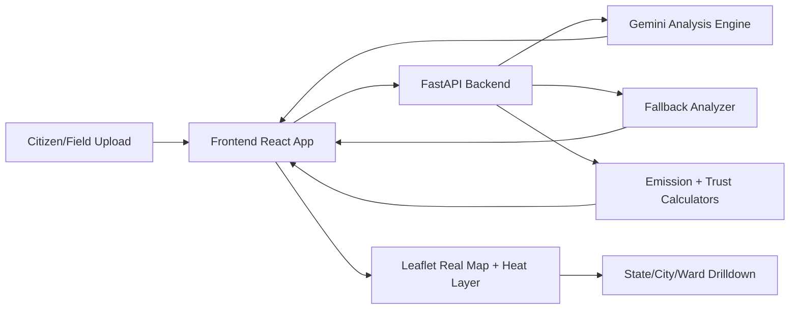

# CivicTrust AI

AI-powered, map-first civic intelligence platform for garbage dump and complaint management across India.

CivicTrust AI converts on-ground image evidence into actionable municipal intelligence through a drilldown workflow:

`India -> State -> City -> Ward -> Dump Site`

It combines geotagged uploads, AI waste analysis, complaint intensity heatmaps, trust scoring, and a policy simulation layer.

---

## Why This Project Matters

Urban complaints often fail due to disconnected systems: one app for reporting, another for field ops, no unified geospatial truth, and no transparent confidence score.

CivicTrust AI solves this by linking every uploaded complaint to:
- exact geography (state/city/ward)
- AI-derived waste insights (type, confidence, emissions)
- map drilldown and verification status
- decision support (simulation + ESG metrics)

---

## Core Features

### 1) Upload-to-Map Incident Pipeline
- User uploads image evidence.
- User maps complaint manually to state/city/ward.
- Optional location assist via:
  - browser GPS (if permission granted)
  - IP/VPN fallback (IP geolocation)
- Complaint is pinned to map and linked to metadata.

### 2) Real Interactive Map (Not Static Polygons)
- Leaflet-based slippy map with pan/zoom.
- Satellite-style tiles.
- Drilldown flow:
  - click state marker -> zoom to state
  - click city marker -> zoom to city
  - click ward marker -> near building-level zoom
- Uploaded complaint marker opens image/details popup.

### 3) Complaint Intensity Heatmap Layer
- Toggleable heatmap overlay (`Complaint Heatmap`).
- Intensity derived from complaint risk signals (methane, trust, status) and upload-priority boost.
- Designed for fast hotspot scanning and allocation decisions.

### 4) Trust + Emissions Intelligence
- Per-ward methane risk and trust score.
- Emission rollups (CO2e, CH4, N2O).
- Status lifecycle (`Reported`, `Verified`, `Resolved`).

### 5) Scenario Simulation + ESG
- Policy sliders for composting, collection, and drone assistance.
- Projected reductions and budget efficiency.
- Investor-facing operational snapshot.

### 6) Civic Concierge AI Layer
- Query by state/city/ward/upload context.
- Fast explanation of alerts, trust, and recommended actions.

---

## Technical Architecture



### Frontend
- React 18 + Vite
- Layered UX (Upload -> Map Explorer -> Simulation -> Concierge)
- Leaflet via CDN in `index.html`
- Heatmap via `leaflet.heat` plugin
- Landing video hero + premium dashboard styling

### Backend
- FastAPI + Uvicorn
- Endpoint-driven image analysis pipeline
- Pydantic models for structured outputs
- Gemini integration for AI analysis
- Robust fallback mode when AI dependency/key unavailable

### AI/Analytics
- Waste classification (`organic`, `plastic`, `hazardous`, `mixed`)
- Confidence scoring
- CO2e + methane potential estimation
- Trust scoring and anomaly flags
- Rule-based recommendations for disposal action

---

## Tech Stack

### Frontend
- `react` 18
- `react-dom` 18
- `vite`
- Leaflet (CDN)
- Leaflet Heat plugin (CDN)

### Backend
- `fastapi`
- `uvicorn[standard]`
- `python-multipart`
- `pydantic`
- `pydantic-settings`
- `python-dotenv`
- `google-generativeai`

---

## Repository Structure

```text
civic-trust-ai/
├─ backend/
│  ├─ app/
│  │  ├─ core/config.py
│  │  ├─ models/waste.py
│  │  ├─ routes/waste.py
│  │  └─ services/gemini_service.py
│  ├─ requirements.txt
│  └─ main.py
├─ frontend/
│  ├─ public/media/landing-bg.mp4
│  ├─ src/App.jsx
│  ├─ src/index.css
│  ├─ src/services/api.js
│  ├─ index.html
│  └─ package.json
└─ README.md
```

---

## Setup & Run (Submission Rules)

## Prerequisites
- Python `3.9+`
- Node.js `18+`
- npm `9+`
- Internet connection (for map tiles/CDN scripts and IP geolocation fallback)

## 1) Backend Setup

```bash
cd backend
python3 -m venv .venv
source .venv/bin/activate
pip install -r requirements.txt
```

Create `backend/.env`:

```env
GEMINI_API_KEY=your_key_here
APP_NAME=Civic Trust AI
DEBUG=true
CORS_ORIGINS=http://localhost:5173,http://localhost:3000
```

Run backend:

```bash
uvicorn main:app --reload --port 8000
```

Health check:

- `http://localhost:8000/`
- `http://localhost:8000/api/waste/health`

## 2) Frontend Setup

```bash
cd frontend
npm install
npm run dev
```

Open:
- `http://localhost:5173`

---

## Environment & Network Notes

- If Gemini key is missing/unavailable, backend uses fallback analysis so demo still works.
- Map tiles and Leaflet CDN require internet.
- "Use Current Location" behavior:
  - Primary: browser GPS
  - Fallback: IP geolocation (can reflect VPN exit region)

---

## API Endpoints

### `POST /api/waste/analyze`
Uploads image and returns analysis payload.

Supported types:
- `image/jpeg`
- `image/png`
- `image/webp`

Max size:
- `10 MB`

### `GET /api/waste/health`
Simple service heartbeat.

---

## Demo Flow (Recommended for Judges)

1. Open Layer 1.
2. Click `Use Current Location (GPS/VPN)`.
3. Upload a garbage dump image.
4. Auto-jump to Layer 2 map explorer.
5. Enable `Complaint Heatmap`.
6. Drill state -> city -> ward and open uploaded marker popup.
7. Show trust/emission card + status lifecycle.
8. Move to Layer 3 and run policy simulation.
9. Move to Layer 4 and query concierge with location-specific prompts.

---

## Submission Highlights (Why This Can Win)

- Real geospatial UX, not mock screens.
- Strong civic relevance with India-local drilldown.
- Practical AI + reliability fallback (demo-proof).
- End-to-end evidence lifecycle: upload -> map -> insight -> action.
- High-clarity interface suitable for municipal command center use.

---

## Known Limitations / Next Upgrades

- Current geographies use curated points; next step is official GeoJSON boundaries.
- Add persistent database for incident lifecycle history.
- Add role-based auth for citizen/municipality/investor views.
- Add notification integrations (WhatsApp/email/webhooks).
- Add 3D twin layer (Cesium/Mapbox) for full digital twin realism.

---

## Team Pitch One-Liner

CivicTrust AI turns a single waste complaint photo into a transparent, map-verified, AI-scored municipal action workflow from India-level oversight down to ward-level intervention.
